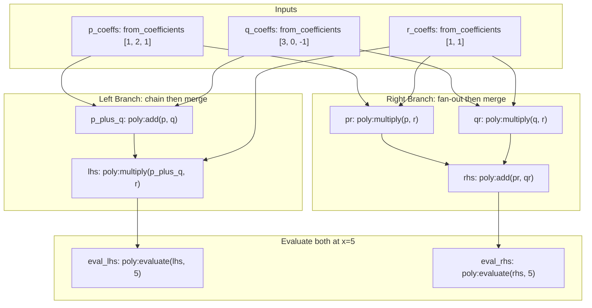

# **Architecture: Invariant (DWE)**

## **1\. Overview**

**Invariant** is a Python-based deterministic execution engine for directed acyclic graphs (DAGs). It is designed to orchestrate complex computational workflows—such as media transcoding, rendering, or scientific data processing—where the cost of re-computation is high.

### **1.1 Core Value Proposition**

Unlike task schedulers (e.g., Apache Airflow, Luigi) which focus on *when* to run tasks, Invariant focuses on *what* is being produced. It treats every operation as a pure function: Op(Input) \= Output.

By enforcing **hermeticity** (no hidden inputs) and **immutability** (read-only outputs), Invariant provides:

1. **Aggressive Caching:** Artifacts are reused across runs and even across different pipelines if their inputs match.  
2. **Deduplication:** Identical operations requested by different parts of the graph are executed only once.  
3. **Reproducibility:** A workflow run today produces bit-for-bit the same output as one run next year (assuming the underlying Op implementation is deterministic).

### **1.2 Influences & Similar Systems**

* **Google Bazel (Blaze):** Invariant adopts Bazel's concept of the "Action Graph" and "Artifact Cache." Just as Bazel caches build artifacts (.o files) based on the hash of source files and compiler flags, Invariant caches data artifacts based on the hash of input data and operation parameters.  
* **TensorFlow:** Invariant mirrors the "Computation Graph" model where nodes represent operations and edges represent the flow of immutable data tensors, separating the graph definition phase from the execution phase.  
* **Functional Programming:** The engine enforces a side-effect-free model where "mutation" is modeled as creating a new version of data.

## **2\. Core Philosophy & Constraints**

### **2.1 The "Immutability Contract"**

* **Principle:** Once an **Artifact** is generated, it is frozen.  
* **Constraint:** Downstream nodes cannot modify an upstream artifact in place. They must consume it and produce a *new* artifact.

### **2.2 The "Determinism Contract"**

* **Principle:** An **Op** must rely *only* on the data provided in its **Input Manifest**.  
* **Constraint:** Access to global state, system clocks (time.now()), or random number generators (random.random()) inside an Op is forbidden unless those values are passed in as explicit inputs from the graph's root.

### **2.3 The "Strict Numeric" Policy**

* **Problem:** IEEE 754 floating-point numbers are non-deterministic across architectures and serialization formats.  
* **Constraint:** Native float types are **forbidden** in the cacheable data protocol.  
* **Solution:** Use decimal.Decimal (canonicalized to string) or integer ratios for fractional data.

## **3\. Data Protocol & Component Naming**

We strictly normalize naming to ensure clarity across the system.

| Term | Definition | Analogous Concept |
| :---- | :---- | :---- |
| **Node** | A vertex in the DAG defining *what* to do. Contains op name, params, and references to upstream deps. | Build Target |
| **Op** | The underlying Python function implementing the logic. | Kernel / Function |
| **Manifest** | The fully resolved, static dictionary of inputs for a specific Node execution. | Call Frame / Props |
| **Artifact** | The immutable output produced by an Op. | Build Artifact / Tensor |
| **Digest** | The SHA-256 hash of a Manifest. Serves as the **Identity** of a potential Artifact. | Cache Key |

### **3.1 The ICacheable Protocol**

All data passed between Nodes must adhere to this protocol to ensure valid Manifest construction.

from typing import Protocol, BinaryIO

class ICacheable(Protocol):  
    def get\_stable\_hash(self) \-\> str:  
        """  
        Returns a deterministic SHA-256 hash of the object's structural state.  
        This represents the 'Identity' of the data.  
        """  
        ...

    def to\_stream(self, stream: BinaryIO) \-\> None:  
        """  
        Serializes the object to a binary stream for persistent storage.  
        """  
        ...

    @classmethod  
    def from\_stream(cls, stream: BinaryIO) \-\> 'ICacheable':  
        """  
        Hydrates the object from a binary stream.  
        """  
        ...

## **4\. Execution Architecture**

The execution flow is split into two distinct phases to maximize cache hits.

### **Phase 1: Context Resolution (Graph \-\> Manifest)**

The engine traverses the user-defined DAG. For each Node, it resolves inputs to create an **Input Manifest**.

* **Inputs:**  
  1. Static Parameters (from Node definition).  
  2. Upstream Artifacts (results from deps).  
* **Process:**  
  * The engine recursively calculates the get\_stable\_hash() for every item.  
  * It assembles a canonical dictionary (sorted keys) of these inputs.  
* **Output:** The **Manifest**. The hash of this Manifest becomes the **Digest** (Cache Key).

### **Phase 2: Action Execution (Manifest \-\> Artifact)**

* **Step 1: Cache Lookup**  
  * Engine checks ArtifactStore.exists(Op, Digest).  <- this is essential, artifact is the output of an operation for a particular input manifest. Antother operation could in theory get the same input manifest and would return a different result.
  * *If True:* Returns the stored Artifact. **Op is strictly skipped.**  
* **Step 2: Execution**  
  * *If False:* Engine invokes OpRegistry.get(op\_name)(manifest).  
* **Step 3: Persistence**  
  * The resulting Artifact is serialized and saved to ArtifactStore under Operation and Digest.

## **5\. System Components**

### **5.1 OpRegistry**

A singleton registry mapping string identifiers to executable Python callables.

* *Role:* Decouples the "string" name in the YAML/JSON definition from the actual Python code.

### **5.2 Graph Resolver**

Responsible for parsing the definition and ensuring a valid DAG.

* *Role:* Cycle detection, validation, and Topological Sorting.

### **5.3 Executor**

The runtime engine.

* *Role:* Iterates the sorted nodes, manages the "Phase 1 \-\> Phase 2" loop, handles failures, and reports progress.

### **5.4 Artifact Store**

The storage abstraction.

* *Implementations:*  
  * MemoryStore: fast, ephemeral (testing).  
  * DiskStore: local filesystem (.invariant/cache/).  
  * CloudStore: S3/GCS buckets for shared team caches.

## **6\. Development Stages**

1. **Core Protocols:** Implement ICacheable, stable recursive hashing, and Decimal support.  
2. **Engine Logic:** Build GraphResolver and Executor.  
3. **Storage:** Implement DiskStore.  
4. **Ops Standard Library:** Implement foundational Ops (dict manipulation, basic math) to prove the DAG.

## **7\. Examples**

**NOTE** This example is final. If something is not clear, make
sure to clarify before changing any of the details below.

* justmyresource:get, gfx:render_solid - these are operations. They are prefixed to avoid naming collisions, but ultimately that doesn't matter. They must be assigned to the operation register prior to the execution of the pipeline

* "${root.width}", "${decimal(background.width) * decimal('0.75')}" - these are expressions that are evaluated against the declared dependencies of the node. Not declaring something referenced in these expressions will raise an error. 

One could have a Node that simply evaluated an expression and returns the value - that is effectively what all of these nodes do:

1. evaluate
2. check hash
3. fetch from cache or calculate
4. store in cache new output


```python
from invariant import Node, Executor, OpRegistry
from invariant.store.memory import MemoryStore

# Define the graph
graph = {
    
    "icon_blob": Node(
        op_name="justmyresource:get",
        params={
            "name": "lucide:thermometer",
        },
        deps=[],
    ),
    
    # Create background
    "background": Node(
        op_name="gfx:render_solid",
        params={
            "width": "${root.width}",
            "height": "${root.height}",
            "color": "#000000",
        },
        deps=["root"],
    ),

    # Render icon SVG to raster
    "icon": Node(
        op_name="gfx:render_svg",
        params={
            # Here we see complex expressions using dependencies
            "width": "${decimal(background.width) * decimal('0.75')}",
            "height": "${decimal(background.height) * decimal('0.75')}",
            "svg": "${icon_blob.data}"
        },
        deps=["background", "icon_blob"],
    ),
    
    # Composite onto background
    "final": Node(
        op_name="gfx:composite",
        params={
            "layers": [
                {
                    "id": "bg",
                    "image": "${background.image}",
                },
                {
                    "image": "${icon.image}",
                    # Don't worry too much about this for now
                    # The important thing here is that this is
                    # internally evaluated in the gfx:composite
                    # operation and simply treated as text for
                    # the cache layer
                    "pos": "align('bg', 'cc')"
                },
            ],
        },
        deps=["background", "icon"],
    ),
}

registry = OpRegistry()
# ... ops must be registered before execution ...
store = MemoryStore()
executor = Executor(registry=registry, store=store)

root = {
  "width": 144,
  "height": 144,
}
results = executor.execute(graph, context={"root": root})
final_image = results["final"]
```

### **7.1 External Dependencies (Context)**

In the example above, the `"background"` node declares `deps=["root"]`, but `"root"` is not a node in the graph — it is an external input provided via the `context` parameter.

No special node type is needed to distinguish external inputs from graph-internal dependencies. The rule is simple:

* Any dependency that **is** a key in the graph is an **internal** dependency, resolved by executing that node first.
* Any dependency that **is not** a key in the graph is an **external** dependency, and **must** be provided in `context`.
* If a dependency is neither in the graph nor in `context`, execution fails with an error.

The `Executor` injects context values into the resolved artifacts before the topological sort loop begins, making them available to any node that declares them as a dependency. From the node's perspective, there is no difference between consuming an internal artifact and consuming an external context value — both are accessed the same way via `${...}` expressions.

### **7.2 Expression Language (CEL)**

Invariant uses [CEL (Common Expression Language)](https://github.com/google/cel-spec) to evaluate `${...}` expressions in node parameters. CEL is a non-Turing-complete, side-effect-free expression language developed by Google, used in production systems including Kubernetes and Cloud IAM.

#### **Why CEL**

CEL enforces the same guarantees Invariant requires:

* **No side effects:** Expressions cannot perform I/O, mutate state, or access globals.
* **Guaranteed termination:** The language has no loops or recursion — every expression completes in bounded time.
* **Deterministic:** The same inputs always produce the same output.

These properties are intrinsic to the language, not constraints we impose on top of a general-purpose evaluator.

#### **Expression Syntax**

Expressions appear inside `${...}` delimiters within node parameter values. The content between the delimiters is a CEL expression. A parameter value without `${...}` is treated as a plain literal — no evaluation occurs.

* `"${root.width}"` — evaluated as CEL, resolves field `width` from the `root` dependency.
* `"#000000"` — plain string literal, passed through unchanged.
* `"align('bg', 'cc')"` — also a plain string literal (no `${}`), interpreted by the Op itself, not by the expression engine.

#### **Execution Scope**

When a `${...}` expression is evaluated, the following is available:

| Available | Description |
| :---- | :---- |
| **Dependency artifacts** | Each node ID declared in `deps` is available as a variable. Artifacts are exposed as CEL maps — field access (e.g., `background.width`) reads properties from the artifact. |
| **`decimal(value)`** | Custom function. Constructs a Decimal from an `int` or `string`. Fractional values **must** use string form (e.g., `decimal('0.75')`) per the Strict Numeric Policy. |
| **Standard CEL operators** | Arithmetic (`+`, `-`, `*`, `/`, `%`), comparison (`==`, `!=`, `<`, `>`, `<=`, `>=`), logical (`&&`, `\|\|`, `!`), ternary (`condition ? a : b`), string functions (`size`, `contains`, `startsWith`, `endsWith`, `matches`), list/map operations (`in`, `size`, indexing). |

The following is **not** available and will produce an error:

| Forbidden | Reason |
| :---- | :---- |
| **Undeclared dependencies** | Referencing a node ID not listed in `deps` is an error, even if that node exists in the graph. This ensures the dependency graph is explicit. |
| **`double` results** | An expression whose final result is a floating-point value is rejected at the manifest boundary. Use `decimal()` for fractional arithmetic. |
| **External state** | CEL cannot access the filesystem, network, system clock, or any state outside the expression scope. This is enforced by the language itself. |

#### **Evaluation Timing**

Expressions are evaluated during **Phase 1 (Context Resolution)**, when the Executor builds the Manifest for each node. The resolved value replaces the `${...}` in the parameter, and the complete Manifest is then hashed to produce the Digest. The expression itself is never cached — only its resolved result matters for cache identity.

## **8\. Reference Test Pipeline**

To validate Invariant's core capabilities—chains, branches, merges, and deduplication—we need a reference test case that exercises complex DAG structures without requiring external dependencies. **Polynomial arithmetic over integers** serves as an ideal reference implementation.

### **8.1 Why Polynomials**

Polynomial arithmetic is well-suited for testing Invariant because:

* **All integer arithmetic** — coefficients are lists of `int`, satisfying the Strict Numeric Policy with zero `float` involvement.
* **Pure functions** — every operation (add, multiply, derive, evaluate) is deterministic and side-effect-free.
* **Natural DAG structure** — verifying algebraic identities (e.g., the distributive law) requires chains, fan-out, fan-in, and re-convergence.
* **Non-trivial cost** — polynomial multiplication is O(n*m) convolution, making caching meaningful even in a test.
* **No external dependencies** — everything is `int` lists and basic loops.

### **8.2 Polynomial Type Specification**

A `Polynomial` type implements `ICacheable` and wraps a `tuple[int, ...]` of coefficients, where the index represents the degree (coefficient at index `i` is the coefficient of x^i).

**Canonical Form:** Trailing zeros are stripped to ensure a unique representation. For example, `[1, 2, 0, 0]` is canonicalized to `[1, 2]`.

**ICacheable Implementation:**

* `get_stable_hash()`: Returns SHA-256 hash of the canonical coefficient tuple.
* `to_stream()`: Serializes as length-prefixed sequence of 8-byte signed integers (big-endian).
* `from_stream()`: Deserializes from the same format and strips trailing zeros.

### **8.3 Polynomial Operations**

The following operations are implemented as pure functions taking a manifest and returning an `ICacheable`:

| Op Name | Inputs | Output | Notes |
|:--|:--|:--|:--|
| `poly:from_coefficients` | `coefficients: list[int]` | `Polynomial` | Strips trailing zeros for canonical form |
| `poly:add` | `a: Polynomial, b: Polynomial` | `Polynomial` | Pairwise addition, zero-pad shorter polynomial |
| `poly:multiply` | `a: Polynomial, b: Polynomial` | `Polynomial` | Convolution of coefficient lists |
| `poly:scale` | `poly: Polynomial, scalar: Integer` | `Polynomial` | Multiply every coefficient by scalar |
| `poly:derivative` | `poly: Polynomial` | `Polynomial` | `c[i] * i` shifted down one degree |
| `poly:evaluate` | `poly: Polynomial, x: Integer` | `Integer` | Horner's method, pure integer result |

All ops follow the existing stdlib pattern in [`src/invariant/ops/stdlib.py`](src/invariant/ops/stdlib.py), taking `manifest: dict[str, Any]` and returning `ICacheable`.

### **8.4 Reference DAG: Distributive-Law Verification**

The test pipeline verifies the algebraic identity **(p + q) * r == p*r + q*r** and evaluates both sides at a point to confirm numeric equality.



### **8.5 Complete Example**

```python
from invariant import Node, Executor, OpRegistry
from invariant.ops import poly
from invariant.store.memory import MemoryStore
from invariant.types import Integer

# Register polynomial operations
registry = OpRegistry()
registry.register_package("poly", poly)

# Define the graph
graph = {
    # Create polynomials from coefficient lists
    "p": Node(
        op_name="poly:from_coefficients",
        params={"coefficients": [1, 2, 1]},  # x^2 + 2x + 1
        deps=[],
    ),
    "q": Node(
        op_name="poly:from_coefficients",
        params={"coefficients": [3, 0, -1]},  # -x^2 + 3
        deps=[],
    ),
    "r": Node(
        op_name="poly:from_coefficients",
        params={"coefficients": [1, 1]},  # x + 1
        deps=[],
    ),

    # Left branch: (p + q) * r
    "p_plus_q": Node(
        op_name="poly:add",
        params={},
        deps=["p", "q"],
    ),
    "lhs": Node(
        op_name="poly:multiply",
        params={},
        deps=["p_plus_q", "r"],
    ),

    # Right branch: p*r + q*r
    "pr": Node(
        op_name="poly:multiply",
        params={},
        deps=["p", "r"],
    ),
    "qr": Node(
        op_name="poly:multiply",
        params={},
        deps=["q", "r"],
    ),
    "rhs": Node(
        op_name="poly:add",
        params={},
        deps=["pr", "qr"],
    ),

    # Evaluate both sides at x=5
    "eval_lhs": Node(
        op_name="poly:evaluate",
        params={"x": Integer(5)},
        deps=["lhs"],
    ),
    "eval_rhs": Node(
        op_name="poly:evaluate",
        params={"x": Integer(5)},
        deps=["rhs"],
    ),

    # Bonus: derivative chain
    "d1": Node(
        op_name="poly:derivative",
        params={},
        deps=["lhs"],
    ),
    "d2": Node(
        op_name="poly:derivative",
        params={},
        deps=["d1"],
    ),
    "eval_d2": Node(
        op_name="poly:evaluate",
        params={"x": Integer(5)},
        deps=["d2"],
    ),
}

store = MemoryStore()
executor = Executor(registry=registry, store=store)
results = executor.execute(graph)

# Verify distributive law: (p + q) * r == p*r + q*r
assert results["lhs"].coefficients == results["rhs"].coefficients

# Verify numeric equality at x=5
assert results["eval_lhs"].value == results["eval_rhs"].value

# Verify derivative chain
# d2 should be the second derivative of lhs
assert isinstance(results["eval_d2"], Integer)
```

### **8.6 Pipeline Features Exercised**

| Pipeline Feature | Where It Appears | Notes |
|:--|:--|:--|
| **Chain** | `p -> p_plus_q -> lhs -> eval_lhs` | 3-deep linear chain |
| **Branch (fan-out)** | `r` feeds `lhs`, `pr`, and `qr`; `p` feeds `p_plus_q` and `pr` | Single artifact used by multiple downstream nodes |
| **Merge (fan-in)** | `rhs = poly:add(pr, qr)` | Two branches converge into one node |
| **Deduplication** | If `p == q`, then `pr` and `qr` produce identical manifests | Same digest triggers single execution |
| **Cache reuse** | Running the same graph twice skips all ops on the second run | All artifacts retrieved from cache |
| **Deep chains** | `lhs -> d1 -> d2 -> eval_d2` | 4-deep chain with derivative operations |
| **Re-entrant patterns** | `d1` and `eval_lhs` both depend on `lhs` | Same artifact reused across multiple paths |

### **8.7 Pattern: Canonicalizing Commutative Inputs**

For commutative operations like addition or multiplication, the order of operands does not affect the result, but it *does* affect the manifest hash. Consider two nodes computing the same sum with arguments in different order:

* `add(x, y)` → manifest `{a: x_value, b: y_value}` → digest `abc123...`
* `add(y, x)` → manifest `{a: y_value, b: x_value}` → digest `def456...` (cache miss!)

The engine correctly treats these as distinct computations because it has no knowledge of commutativity. The manifest is an ordered dictionary, so different parameter orderings produce different digests, even when the mathematical result is identical.

**Solution:** Use `min()` and `max()` in the `${...}` expressions to canonicalize operand order:

```python
graph = {
    "x": Node(
        op_name="stdlib:from_integer",
        params={"value": 7},
        deps=[],
    ),
    "y": Node(
        op_name="stdlib:from_integer",
        params={"value": 3},
        deps=[],
    ),

    # First node: explicitly uses x, y order
    "sum_xy": Node(
        op_name="stdlib:add",
        params={"a": "${min(x, y)}", "b": "${max(x, y)}"},
        deps=["x", "y"],
    ),

    # Second node: uses y, x order in expressions — same result!
    "sum_yx": Node(
        op_name="stdlib:add",
        params={"a": "${min(y, x)}", "b": "${max(y, x)}"},
        deps=["x", "y"],
    ),
}

# Both sum_xy and sum_yx resolve to manifest {a: 3, b: 7}
# Same digest -> single execution, cache hit for the second node
```

Both nodes resolve to the same manifest `{a: 3, b: 7}` because `min(x, y)` and `min(y, x)` both evaluate to `3`, and `max(x, y)` and `max(y, x)` both evaluate to `7`. The canonical ordering ensures cache hits regardless of how the dependencies are declared or referenced in expressions.

**Note:** `min()` and `max()` are custom CEL functions registered alongside `decimal()`, available in the expression evaluation scope. They work with any comparable types (integers, decimals, strings) and ensure deterministic canonicalization for commutative operations.

