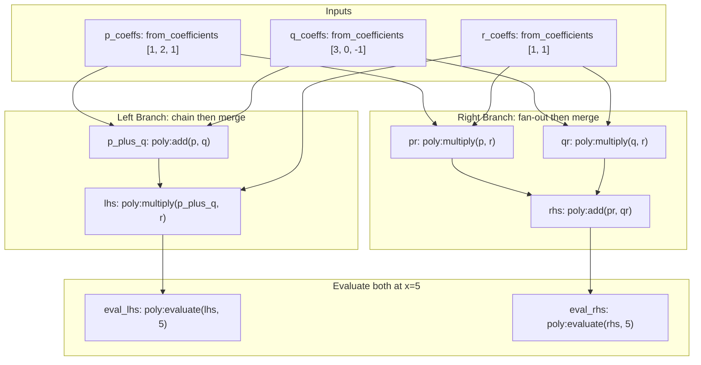

# Examples

This directory contains runnable examples demonstrating Invariant's core capabilities.

## Polynomial Distributive Law

**File:** [`polynomial_distributive.py`](./polynomial_distributive.py)

Demonstrates Invariant's core capabilities using polynomial arithmetic to verify the algebraic identity **(p + q) \* r == p\*r + q\*r**. This example exercises chains, branches, merges, and deduplication without requiring external dependencies.

**Run:**
```bash
poetry run python examples/polynomial_distributive.py
```

The example creates three polynomials from coefficient lists, then computes both sides of the distributive law through different paths in the DAG:

**Basic node creation:** Nodes like `p`, `q`, and `r` use `poly:from_coefficients` to create polynomials from coefficient lists:
```python
"p": Node(
    op_name="poly:from_coefficients",
    params={"coefficients": [1, 2, 1]},  # x^2 + 2x + 1
    deps=[],
)
```

**Using `ref()` for artifact passthrough:** The `p_plus_q` node passes entire polynomial artifacts:
```python
"p_plus_q": Node(
    op_name="poly:add",
    params={"a": ref("p"), "b": ref("q")},
    deps=["p", "q"],
)
```

**Chain patterns:** Linear sequences like `p -> p_plus_q -> lhs -> eval_lhs` demonstrate how artifacts flow through chains.

**Branch/merge patterns:** The right branch shows fan-out and fan-in: `p` and `r` both feed into `pr`, while `q` and `r` feed into `qr`, then both `pr` and `qr` merge into `rhs`.

**Deep chains:** The derivative chain `lhs -> d1 -> d2 -> eval_d2` demonstrates 4-deep linear dependencies.

### DAG Structure



### Pipeline Features Exercised

| Pipeline Feature | Where It Appears | Notes |
|:--|:--|:--|
| **Chain** | `p -> p_plus_q -> lhs -> eval_lhs` | 3-deep linear chain |
| **Branch (fan-out)** | `r` feeds `lhs`, `pr`, and `qr`; `p` feeds `p_plus_q` and `pr` | Single artifact used by multiple downstream nodes |
| **Merge (fan-in)** | `rhs = poly:add(pr, qr)` | Two branches converge into one node |
| **Deduplication** | If `p == q`, then `pr` and `qr` produce identical manifests | Same digest triggers single execution |
| **Cache reuse** | Running the same graph twice skips all ops on the second run | All artifacts retrieved from cache |
| **Deep chains** | `lhs -> d1 -> d2 -> eval_d2` | 4-deep chain with derivative operations |
| **Re-entrant patterns** | `d1` and `eval_lhs` both depend on `lhs` | Same artifact reused across multiple paths |

---

## Commutative Canonicalization

**File:** [`commutative_canonicalization.py`](./commutative_canonicalization.py)

For commutative operations like addition or multiplication, the order of operands does not affect the result, but it *does* affect the manifest hash. Consider two nodes computing the same sum with arguments in different order:

* `add(x, y)` → manifest `{a: x_value, b: y_value}` → digest `abc123...`
* `add(y, x)` → manifest `{a: y_value, b: x_value}` → digest `def456...` (cache miss!)

The engine correctly treats these as distinct computations because it has no knowledge of commutativity. The manifest is an ordered dictionary, so different parameter orderings produce different digests, even when the mathematical result is identical.

**Solution:** Use `min()` and `max()` in `cel()` expressions to canonicalize operand order.

**Run:**
```bash
poetry run python examples/commutative_canonicalization.py
```

**Example pattern:**

```python
from invariant import Node, OpRegistry, cel

graph = {
    "x": Node(
        op_name="stdlib:identity",
        params={"value": 7},
        deps=[],
    ),
    "y": Node(
        op_name="stdlib:identity",
        params={"value": 3},
        deps=[],
    ),

    # First node: explicitly uses x, y order
    "sum_xy": Node(
        op_name="stdlib:add",
        params={"a": cel("min(x, y)"), "b": cel("max(x, y)")},
        deps=["x", "y"],
    ),

    # Second node: uses y, x order in expressions — same result!
    "sum_yx": Node(
        op_name="stdlib:add",
        params={"a": cel("min(y, x)"), "b": cel("max(y, x)")},
        deps=["x", "y"],
    ),
}

# Both sum_xy and sum_yx resolve to manifest {a: 3, b: 7}
# Same digest -> single execution, cache hit for the second node
```

Both nodes resolve to the same manifest `{a: 3, b: 7}` because `min(x, y)` and `min(y, x)` both evaluate to `3`, and `max(x, y)` and `max(y, x)` both evaluate to `7`. The canonical ordering ensures cache hits regardless of how the dependencies are declared or referenced in expressions.

**Note:** `min()` and `max()` are custom CEL functions registered alongside `decimal()`, available in the expression evaluation scope. They work with any comparable types (integers, decimals, strings) and ensure deterministic canonicalization for commutative operations.

